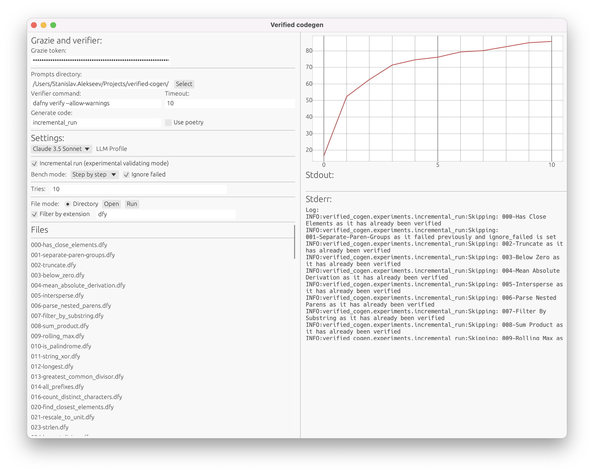

# Automation tool for verifying code using LLMs

Example usage:

```
export GRAZIE_JWT_TOKEN=insert grazie token
python main.py --insert-invariants-mode=llm --llm-profile=gpt-4-1106-preview --prompts-directory=llm/rust -i RustBench/ground_truth/binary_search.rs
```

or

```
export GRAZIE_JWT_TOKEN=insert grazie token
python main.py --insert-invariants-mode=llm --llm-profile=gpt-4-1106-preview --prompts-directory=llm/dafny -i DafnyBench/hints_removed/630-dafny_tmp_tmpz2kokaiq_Solution_no_hints.dfy
```

To run the gui, run it directly from the verified-cogen directory:

```
cargo run --manifest-path=gui/Cargo.toml
```



Available invariants insertion mode:

- regex - insert invariants manually after the loop, only works if the program has exactly one `while` loop, works only for dafny
- llm - use LLM to insert invariants into the correct place, as a separate step from producing them
- llm-single-step - use LLM to add invariants to rewrite the program to include invariants, as a singlestep

Profiles are from grazie, useful ones:

- gpt-4-1106-preview - GPT4-Turbo
- gpt-4o - GPT-4o
- anthropic-claude-3-opus - Claude 3 Opus

## Current status

Verified with modification for Rust:

- Cubes
- Reverse
- Replace Chars
- Max Array
- String Xor
- Binary Search
- Two Sum
- Is Sorted
- Integer Square Root
- Intersperse
- Unique With Hint
- Unique No Hints

Failed:

- Smallest Missing Number
- Has Close Elements
